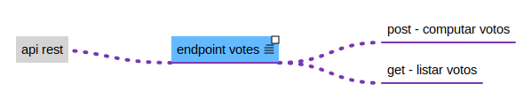
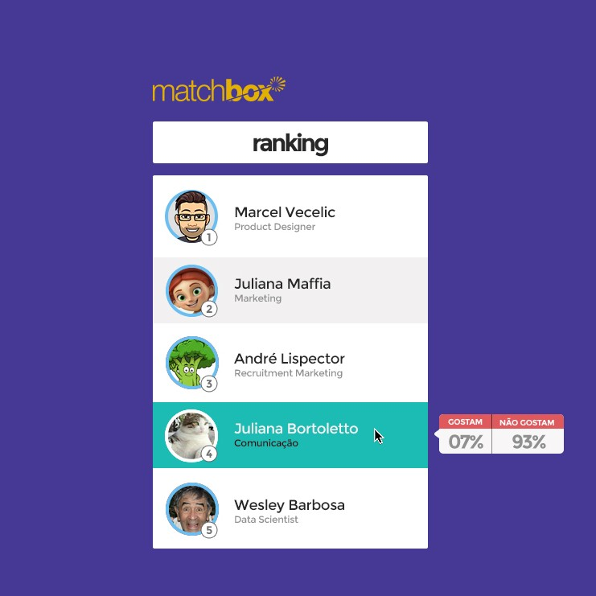

# Sobre a Matchbox Brasil

A Matchbox nasceu para revolucionar a forma como empresas e jovens se conectam e se relacionam.
Conheça: <http://matchboxbrasil.com>

## Teste Fullstack para a Matchbox Brasil

Esse teste tem por objetivo entendermos sua lógica e conhecimento na resolução dos problemas propostos, onde consideraremos as tecnologias php/Symfony, banco de dados preferencialmente MySQL e frontend ReactJS.

### Desafio

Neste desafio deverá ser criado um projeto do zero com utilização do framework symfony, criar estrutura na base de dados de usuários e votos, criar um seeder com os dados contidos no arquivo data.json, também deverá ser criado endpoint para retornar todos os usuários com os referidos votos e para permitir que o visitante possa realizar voto, deve-se considerar que cada visitante pode votar apenas uma vez.

Também deverá ser criado uma aplicação em react para consumir essa api rest, e deverá seguir o design:

### Observações

- O visitante deve votar apenas uma vez.
- Caso ele não tenha votado deve aparecer as opções de Gosto / Não gosto.
- Apresentar os dados requisitados pelo layout.
- Calcular a porcentagem de "positives" e "negatives".
- Ordernar os items do json a partir da porcentagem calculada acima.
- A fonte utilizada é Montserrat.

## Orientações

Serão utilizados os seguintes critérios para avaliação do teste:

### Requisitos obrigatórios

1. Utilizar um pré-processador CSS de sua preferência.
2. Semântica Web
3. Ser fiel ao .jpg e requisitos
4. Procure manter a estrutura do projeto.
5. Crie uma documentação de como executar o projeto

### Diferencial

- Acessibilidade
- SEO
- Performance
- Testes unitários
- Docker

## Submissão

Crie um repositório privado e nos invite pelo email produto@matchboxbrasil.com.

Iremos instalar e executar quaisquer dependências necessárias, então certifique-se de colocar todos os arquivos necessários e as devidas instruções.

## Dúvidas

Em caso de dúvidas, envie e-mail para produto@matchboxbrasil.com

## Obrigado

Agradecemos sua participação no teste. Boa sorte! :)
